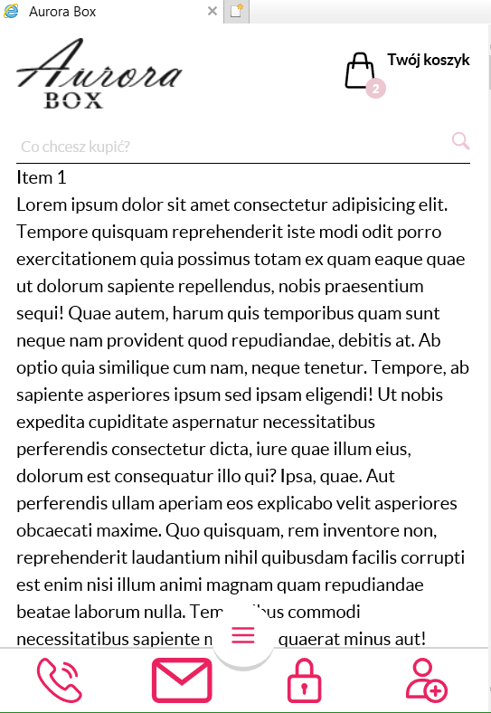

# Below there are screenshots in browsers

1. Everything is done without using JS, only HTML / CSS.
2. Standard breakpoints are used.
3. For mobile, I used standard interface design patterns:

- Action bar at the bottom
- Menu button at the bottom, closer to the fingers.
- All pop-ups are full screen. Although it is the best choice for desktop applications.

1. PostCSS as an industry standard. And JIT Tailwind preprocessor, I used to use compass sass and many others, but now it is overkill.
2. Gulp as the industry standard.
3. External libraries used only for assembly.

## What you should pay attention to?

1. Correct semantic HTML-code.
2. I used FlexBox, but sometimes it was faster to use a table layout. Grid is very limited in its use and transpilation.
3. Below there are screenshots from different devices.
4. Variables are low-level enough, therefore, their direct use should be avoided, to maintain constraints there is a design system.
5. I've used BEM for most of my career. However, it is now outdated, like many other approaches to maintaining constraints. So I stick with functional CSS as needed.
6. More than 40 commits in the repository were made by me.
7. I didn't animate anything except the drop-down menu. Just because it needs a color palette to do it, but there are only 50 shades of gray in the layout.

## What should I avoid?

1. It would be strange to use something like Bootstrap. Usually they use grids from libraries, but for this the designer must follow the rhythm and use a grid.

## Browsers

Alas, I don't have Safari.

## What will we look for when evaluating?

1. I checked in the W3C, there are some warnings about roles, however they are based on the assumption that the html document will never change again.
2. Almost all styles and elements are reusable.
3. Hard to follow DRY without using a good templating engine.

## Browser Test

### android

| menu chrome                              | opera mini                              | scroll chrome                              |
| ---------------------------------------- | --------------------------------------- | ------------------------------------------ |
|  |  |  |

### mobile

| ie11                             | submenu ie11                             |
| -------------------------------- | ---------------------------------------- |
|  |  |

### md

| chrome                         | ie11                         |
| ------------------------------ | ---------------------------- |
|  |  |

### lg

| chrome                         | edge                         | ff                         | ie11                         |
| ------------------------------ | ---------------------------- | -------------------------- | ---------------------------- |
|  |  |  |  |
